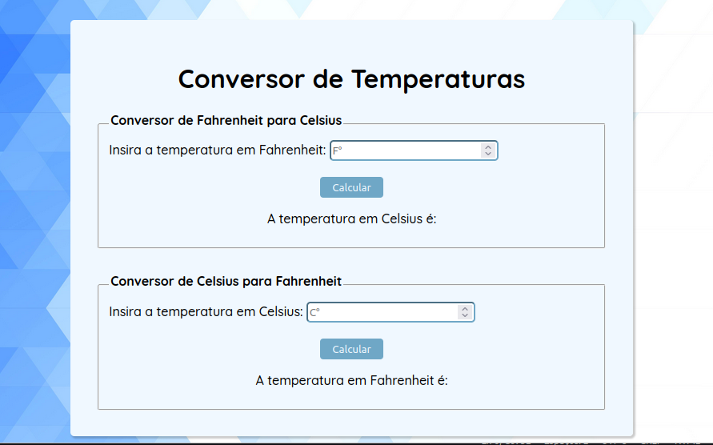

# Conversor de temperatura

<a href="#conversões" style="border: solid 1px; padding: 5px 20px" >Conversões</a>  <a href="#tecnologias"  style="border: solid 1px; padding: 5px 20px">Tecnologias Utilizadas</a>

Conversor de temperatura criado com Javascript, realizando cálculos com dados diretamente inseridos pelo usuário. 

## Conversões

Existem duas conversões ativas, que são de Celsius para Fahrenheit e de Fahrenheit para Celsius.

### Tecnologias

* HTML: Foi utilizado para marcação dos elementos e para criação do formulário de entrada dos dados que o usuário deseja converter.

* CSS: Foi utilizado para estilizar os elementos.

* JavaScript: Foi utilizado para realizar a captura dos dados inseridos pelo usuário e o cálculo de conversão. Também é utilizado para inserção do resultado dentro do documento.